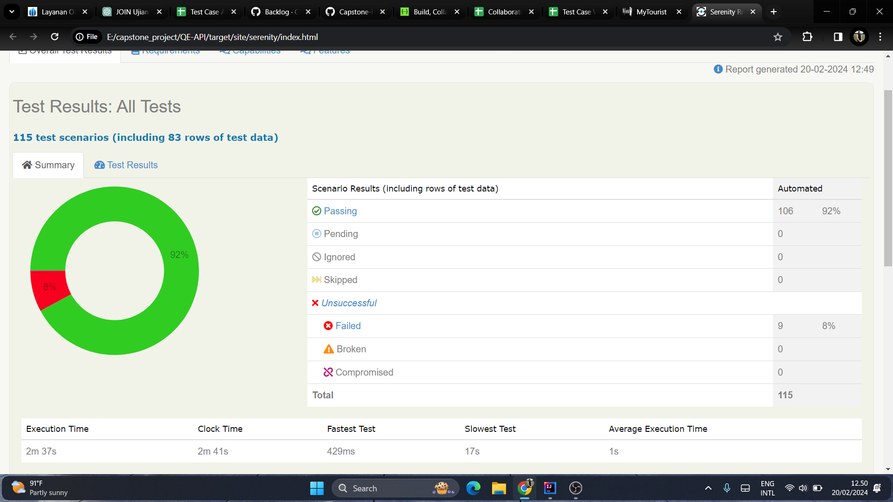

# PROJECT DESCRIPTION

Ini adalah sebuah program API Automation Testing yang dibuat untuk project MyTouristTicket. 

## Manual Testing
Untuk melihat dokumentasi dari manual testing yang dibuat, klik di sini :
https://docs.google.com/spreadsheets/d/1KxLo50UoGlOxkGi9O9pPc6htPq7w94AhTRyQ446Up90/edit?usp=sharing

## Overall Report


## Tools and Technology Stack
- **Integrated Development Environment (IDE):** [IntelliJ IDEA Community Edition](https://www.jetbrains.com/idea/)
  - *Deskripsi:* IntelliJ IDEA Community Edition digunakan sebagai IDE untuk pengembangan perangkat lunak dalam proyek ini. Menyediakan fitur-fitur kaya untuk penyuntingan kode, debugging, dan manajemen proyek.

- **Testing and Automation:**
  - **Serenity**
    - *Deskripsi: Serenity adalah framework pengujian otomatis yang memberikan fokus pada pembuatan laporan yang kaya dan mudah dimengerti. Dengan menggunakan Serenity, Anda dapat 
menyederhanakan pembuatan dan pelaksanaan tes otomatis serta mendapatkan laporan yang informatif tentang hasil pengujian* .
  - **Cucumber**
    - *Deskripsi: Cucumber adalah alat pengembangan berbasis perilaku (BDD) yang memungkinkan tim pengembang dan pemangku kepentingan menulis skenario pengujian dalam bahasa manusia yang dapat dibaca. Dengan menggunakan Cucumber, Anda dapat membuat dokumentasi hidup tentang perilaku aplikasi dan memudahkan komunikasi antara tim pengembang dan non-pengembang*
  - **RestAssured**
    - *Deskripsi: RestAssured adalah perpustakaan Java yang digunakan untuk pengujian RESTful APIs. Dengan RestAssured, Anda dapat menguji endpoint API dengan mudah, memvalidasi respons, dan melakukan interaksi dengan layanan HTTP. RestAssured membantu memastikan keandalan dan fungsionalitas dari layanan web yang dikembangkan*

- **Build Management:**
  - **Maven**
    - *Deskripsi:* Maven digunakan sebagai alat manajemen proyek untuk mengelola dependensi, konfigurasi, dan proses build proyek. Ini membantu dalam mengatur siklus hidup proyek dan manajemen dependensi secara efisien.
      
- **Version Control:**
  - **Git**
    - *Deskripsi:* Git adalah sistem kontrol versi terdistribusi yang memfasilitasi pengembangan kolaboratif, melacak perubahan dalam kode sumber, dan mengelola sejarah proyek.

# HOW TO RUN PROJECT

Berikut adalah langkah-langkah untuk menjalankan aplikasi QE-API:

1. Clone repositori ini ke dalam sistem lokal Anda dengan menggunakan perintah berikut:

    ```bash
    https://github.com/Capstone-Project-My-Tourist-Ticket/QE-API.git
    ```

2. Pastikan Anda telah menginstal Java dan mengatur lingkungan (environment) Java dengan benar di sistem Anda.

3. Buka proyek ini di text editor pilihan Anda.

4. Buka terminal di text editor atau terminal lain yang tersedia.

5. Jalankan perintah berikut untuk membersihkan dan memverifikasi proyek menggunakan Maven:

    ```bash
    mvn clean verify
    ```

   Perintah ini akan membersihkan proyek, mengunduh dependensi, dan menjalankan semua tes yang ada.

6. Setelah proses tersebut selesai tanpa error, Anda sekarang dapat menjalankan aplikasi sesuai dengan kebutuhan proyek.

Pastikan Anda memahami persyaratan dan konfigurasi proyek sebelum menjalankannya. Selamat mencoba!

## TEAM MEMBER
- **Rayhan Arjunastya Miftaharif**

- **Neni Nurhaeni**

- **Ziko Surya Lesmana**
